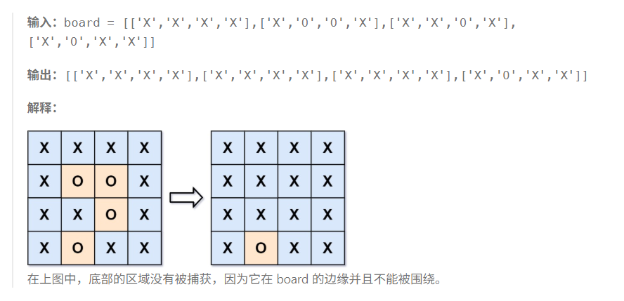

* 【被围绕的区域】
* 给定一个二维数组，由X和O两种字符组合而成，如果O连成的区域到达边缘的话，那么这一块区域就不算被围绕的；
* 否则需要将被围绕的区域全部改成'X'

思路：

1.从边界出发，以所有值为‘O’的点出发，向外扩展，只要可以到达的，就将值修改为'A'

2.然后遍历所有的点，如果还存在'O'的话，就是没办法到达的，就把'O'修改为'X'

3.然后再所有的‘A’修改为'O'。

**补充**

这里向外扩展的时候，建议使用dfs递归，主要就是向四个方向扩展
